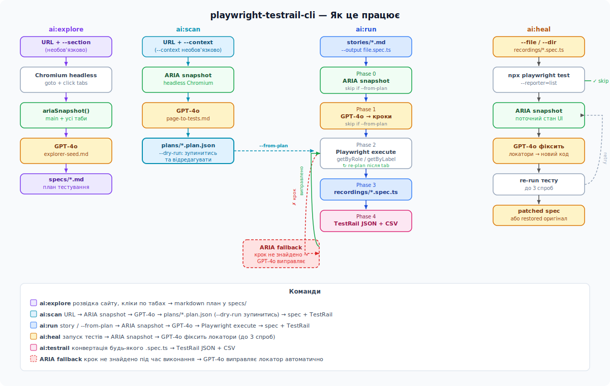

# playwright-testrail-cli

AI-інструмент повного циклу: від дослідження сайту до готових Playwright-тестів і TestRail test cases.

## Як це працює



| Команда | Що робить |
|---------|-----------|
| `ai:explore` | Досліджує сайт (ARIA snapshot + таби + підсторінки) → markdown план тестування |
| `ai:scan` | URL → ARIA snapshot → тест-план по всіх елементах (без сторі) → `.spec.ts` + TestRail |
| `ai:run` | Сторі + ARIA snapshot → набір тестів (positive/negative/boundary) → `.spec.ts` + TestRail |
| `ai:heal` | Запускає падаючі тести, знімає ARIA snapshot, AI виправляє локатори |
| `ai:testrail` | Конвертує будь-який `.spec.ts` → TestRail JSON + CSV |
| `ai:watch` | Автоматично конвертує нові/змінені файли в `recordings/` |

---

## Встановлення

```bash
git clone <url-репозиторію>
cd playwright-testrail-cli
npm install
npx playwright install chromium
cp .env.example .env
```

Відкрийте `.env` та вставте ключ:

```env
OPENAI_API_KEY=sk-...
OPENAI_MODEL=gpt-4o-mini   # необов'язково, за замовчуванням gpt-4o-mini
TEST_LOGIN=your_login       # для тестів з авторизацією
TEST_PASSWORD=your_password
```

---

## Workflow 1 — Page-driven (рекомендований)

Підходить для форм, складних UI, нових ресурсів. AI аналізує всі елементи сторінки і застосовує техніки тест-дизайну до кожного.

### Крок 1 — Згенерувати план

```bash
npm run ai:scan -- --url https://app.example.com/form --dry-run
```

Зберігає план у `plans/app-example-com-form.plan.json` і виводить у консоль:

```
◆  "Page loads with all form sections visible"  [smoke, high]
     · goto https://app.example.com/form
     · assert visible [role: heading: Registration Form]

◆  "Fill required text fields with valid data"  [positive, high]
     · goto https://app.example.com/form
     · fill [role: textbox: First Name]
     · fill [role: textbox: Last Name]
     · assert visible [role: textbox: Last Name]
```

З бізнес-контекстом (сторі як hint, не як обмеження scope):

```bash
npm run ai:scan -- --url https://app.example.com/form \
  --context stories/form.md --dry-run
```

### Крок 2 — Відредагувати план (за потреби)

Відкрийте `plans/*.plan.json` і скоригуйте тести, локатори або тестові дані.

### Крок 3 — Виконати план

```bash
npm run ai:run -- \
  --from-plan plans/app-example-com-form.plan.json \
  --headless \
  --output recordings/form.spec.ts
```

### Крок 4 — Запустити тести

```bash
npx playwright test recordings/form.spec.ts
npx playwright test recordings/form.spec.ts --reporter=html && npx playwright show-report
```

#### Флаги `ai:scan`

| Флаг | Опис |
|------|------|
| `--url https://...` | URL сторінки (обов'язковий) |
| `--context stories/file.md` | Опціональний бізнес-контекст |
| `--dry-run` | Показати план без виконання, зберегти у `plans/` |
| `--headless` | Headless браузер |
| `--output path/to/file.spec.ts` | Куди записати spec файл |
| `--name "my test"` | Задати ім'я для план-файлу |

---

## Workflow 2 — Story-driven

Підходить для конкретних user flow з чітко описаними сценаріями.

### Крок 1 — Дослідити ресурс (опціонально)

```bash
npm run ai:explore -- --url https://app.example.com
npm run ai:explore -- --url https://app.example.com --section "Payments"
```

Результат: `specs/app-example-com.md` — структурований markdown план.

### Крок 2 — Написати сторі

Створіть файл у `stories/` у довільному форматі (Gherkin, plain text, User Story):

```markdown
# Feature: Login

## Scenario 1: Успішна авторизація
Given користувач відкрив https://app.example.com
When вводить валідний логін і пароль та натискає Увійти
Then потрапляє в особистий кабінет
```

### Крок 3 — Згенерувати тести

```bash
npm run ai:run -- \
  stories/login.md \
  --plan specs/app-example-com.md \
  --headless \
  --output recordings/login.spec.ts
```

З прапором `--dry-run` — переглянути план перед виконанням:

```bash
# Згенерувати і переглянути план
npm run ai:run -- stories/login.md --dry-run

# Відредагувати plans/login.plan.json за потреби
# Виконати план
npm run ai:run -- --from-plan plans/login.plan.json --headless
```

#### Флаги `ai:run`

| Флаг | Опис |
|------|------|
| `stories/file.md` | Сторі з файлу |
| `--story "текст"` | Сторі як рядок |
| `--plan specs/file.md` | Контекст від `ai:explore` |
| `--output path/to/file.spec.ts` | Куди записати spec файл |
| `--headless` | Headless браузер |
| `--dry-run` | Згенерувати план без виконання |
| `--from-plan plans/file.plan.json` | Виконати збережений план |

#### Коли використовувати `ai:scan` vs `ai:run`

| | `ai:scan` | `ai:run` |
|---|---|---|
| Основа для тестів | Сторінка (ARIA snapshot) | Сторі / Gherkin |
| Scope | Всі елементи на сторінці | Тільки описані сценарії |
| Типова кількість тестів | 12–20 | 3–8 |
| Підходить для | Форми, складні UI, новий ресурс | Конкретний user flow |

---

## Workflow 3 — Ручний запис

```bash
# Записати сценарій у браузері
npx playwright codegen https://app.example.com

# Зберегти у recordings/my-test.spec.ts
# Конвертувати в TestRail
npm run ai:testrail -- recordings/my-test.spec.ts
```

Або watch-режим — конвертація запускатиметься автоматично:

```bash
npm run ai:watch
```

---

## TestRail артефакти

```bash
npm run ai:testrail -- recordings/login.spec.ts
# або всі файли:
npm run ai:testrail -- --all
# примусово перезаписати (ігнорує кеш 1 год):
npm run ai:testrail -- recordings/login.spec.ts --force
```

Результат у `ai-output/`:

```json
{
  "cases": [
    {
      "section": "Login",
      "title": "Login with valid credentials",
      "preconditions": "User is registered",
      "priority": "High",
      "type": "Smoke",
      "steps": ["Open URL", "Fill login", "Click Submit"],
      "expectedResults": ["User is redirected to dashboard"]
    }
  ]
}
```

---

## Авто-лікування падаючих тестів

```bash
# один файл:
npm run ai:heal -- --file recordings/login.spec.ts
# ціла директорія:
npm run ai:heal -- --dir recordings/
```

Для кожного файлу що падає: знімає ARIA snapshot → AI виправляє локатори → перезапускає (до 3 спроб). Якщо не вдалось — відновлює оригінал.

---

## Claude Code інтеграція

Проект підтримує роботу через Claude Code IDE з sub-agents і slash commands.

### Sub-agents

| Агент | Що робить |
|-------|-----------|
| `playwright-test-planner` | Досліджує сторінку через MCP браузер, створює структурований план |
| `playwright-test-generator` | Генерує тести з плану через реальний браузер |
| `playwright-test-healer` | Дебажить падаючі тести, виправляє локатори інтерактивно |

### Slash commands

| Команда | Що робить |
|---------|-----------|
| `/scan <url>` | `ai:scan --dry-run` для URL |
| `/run-plan <plan.json>` | Виконати збережений план |
| `/heal [file]` | Виправити падаючі тести |
| `/testrail [file]` | Конвертувати spec у TestRail |

Sub-agents і slash commands доступні тільки в Claude Code IDE. CLI (`npm run ai:*`) працює незалежно — підходить для CI/CD і терміналу.

---

## Credentials у тестах

AI автоматично використовує `process.env.TEST_LOGIN` / `process.env.TEST_PASSWORD` замість хардкоду. Додайте реальні значення у `.env` — тести підхоплять їх при запуску.

---

## Структура проекту

```
playwright-testrail-cli/
├── stories/             # Сторі / AC у Gherkin або plain text (.gitignore)
├── specs/               # Markdown плани від ai:explore (.gitignore)
├── plans/               # JSON тест-плани від ai:scan / ai:run (.gitignore)
├── recordings/          # Згенеровані .spec.ts файли (.gitignore)
├── ai-output/           # TestRail JSON + CSV (.gitignore)
├── prompts/
│   ├── page-to-tests.md        # ai:scan: ARIA snapshot → тест-план
│   ├── story-to-steps.md       # ai:run: сторі → тест-кейси
│   ├── codegen-to-testrail.md  # ai:testrail: .spec.ts → TestRail
│   ├── explorer-seed.md        # ai:explore: ARIA snapshots → план
│   ├── aria-fallback.md        # Виправлення локаторів при помилці
│   └── replan-steps.md         # Re-plan після переходу на нову вкладку
├── scripts/
│   ├── scanner.mjs      # ai:scan
│   ├── runner.mjs       # ai:run
│   ├── explorer.mjs     # ai:explore
│   ├── healer.mjs       # ai:heal
│   ├── cli.mjs          # ai:testrail
│   └── watch.mjs        # ai:watch
├── .claude/
│   ├── agents/          # Sub-agents для Claude Code IDE
│   └── commands/        # Slash commands (/scan, /heal, /testrail, /run-plan)
├── docs/
│   ├── how-it-works.svg
│   └── ai-scan-workflow.md
├── .mcp.json            # Playwright MCP сервер для sub-agents
├── CLAUDE.md            # Контекст проекту для Claude Code
├── playwright.config.ts
├── .env                 # Секрети (.gitignore)
├── .env.example
└── package.json
```

---

## Вимоги

- Node.js 18+
- OpenAI API ключ ([platform.openai.com](https://platform.openai.com)) з доступом до `gpt-4o` і `gpt-4o-mini`
- Chromium (`npx playwright install chromium`)

---

## Типові помилки

### `OPENAI_API_KEY не встановлений`
Файл `.env` відсутній або не містить ключа.

### `RateLimitError: Request too large (TPM)`
`ai:explore` зібрав забагато секцій. Використайте `--section` для фокусу на конкретній частині сторінки.

### `No tests found`
У `playwright.config.ts` має бути `testDir: '.'` — без цього Playwright не знаходить тести в `recordings/`.

### `відсутні взаємодії (click/fill/check)`
Файл `.spec.ts` не містить жодної дії. `ai:testrail` пропускає такі файли.

### `Таймаут запиту (30с)`
OpenAI не відповів. CLI автоматично повторить 3 рази з exponential backoff.

### `assert не пройшов під час запису`
Нормальна ситуація коли тест використовує `process.env.*` credentials. Assert все одно записується у spec і виконуватиметься з реальними даними.
